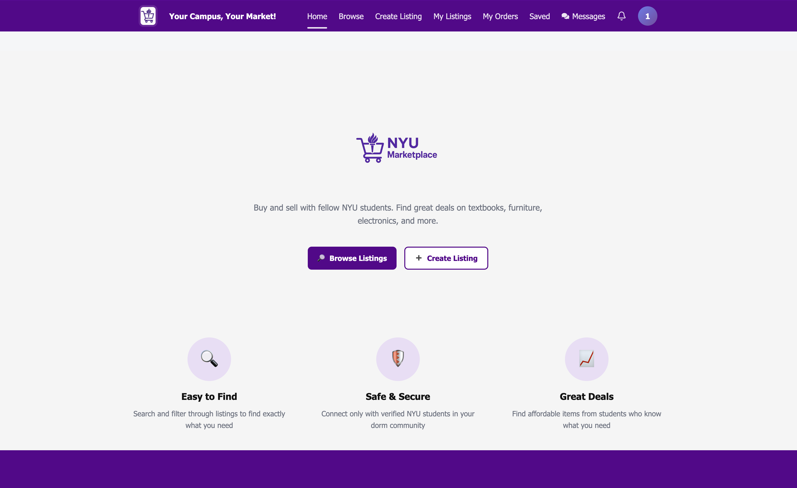
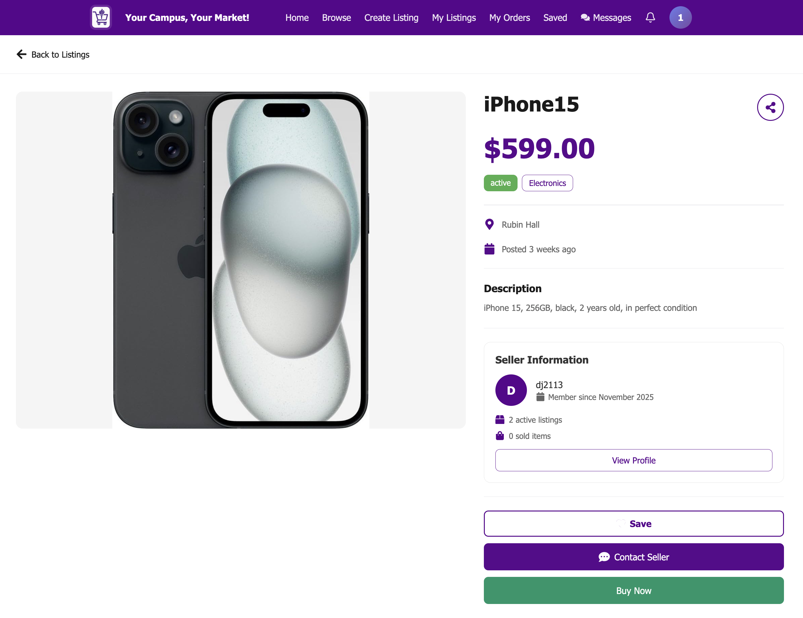

# NYU Marketplace



| Branch | Build Status | Coverage |
|--------|--------------|----------|
| `main` | [](https://app.travis-ci.com/gcivil-nyu-org/team3-mon-fall25) | [](https://coveralls.io/github/gcivil-nyu-org/team3-mon-fall25?branch=main) |
| `develop` | [](https://app.travis-ci.com/gcivil-nyu-org/team3-mon-fall25) | [](https://coveralls.io/github/gcivil-nyu-org/team3-mon-fall25?branch=develop) |


## Table of Contents
- [About the Project](#about-the-project)
- [Key Features](#key-features)
- [Tech Stack](#tech-stack)
- [Getting Started](#getting-started)
- [Agile & Scrum Process](#agile--scrum-process)
- [Development Workflow](#development-workflow)

## About the Project
Buy and sell with fellow NYU students. Find great deals on textbooks, furniture, electronics, and more.



## Key Features
*List the high-level Epics or capabilities delivered.*
- **User Authentication:** Secure login via NYU credentials.
- **Product Listing:** Create, edit, and delete items with image upload support.
- **Search & Filtering:** Advanced filtering by category, price, and condition.
- **Transaction Management:** Secure checkout flow (integration with Stripe/Mock payment).
- **User Profiles:** Dashboard for managing listings and order history.

---

## Tech Stack
This project leverages a modern, scalable architecture deployed on AWS.

| Category | Technology |
|----------|------------|
| **Frontend** | React 19.2, Vite, Bootstrap 5.3 |
| **Backend** | Django 5.2.7, Django REST Framework (DRF) |
| **Database** | PostgreSQL (Production) / MySQL (Local) |
| **DevOps/Cloud** | AWS Elastic Beanstalk, Travis CI, Coveralls |
| **Project Mgmt** | Zenhub, GitHub |
## Getting Started

### Backend — Django

#### Dependency Management with UV

We use [UV](https://github.com/astral-sh/uv) for fast, reliable Python package management. UV is compatible with both Python 3.11 and 3.13.

**Note:** We use `requirements.txt` for dependency management instead of `pyproject.toml` because AWS Elastic Beanstalk (our deployment platform) expects and automatically installs dependencies from `requirements.txt`.

#### Installing UV

```bash
# macOS/Linux
curl -LsSf https://astral.sh/uv/install.sh | sh

# Or with pip
pip install uv
```

#### Setting Up Virtual Environment

```bash
cd backend

# Create virtual environment
uv venv --python 3.11 .venv311

# Or use Python 3.13
uv venv --python 3.13 .venv

# Activate the environment
source .venv/bin/activate  # or .venv311/bin/activate
```

#### Installing Dependencies

```bash
# Install all dependencies from requirements.txt
uv pip install -r requirements.txt
```

#### Updating Dependencies

To update all packages to their latest compatible versions:

```bash
cd backend

# Compile latest versions (maintains compatibility across Python versions)
uv pip compile requirements.in --upgrade -o requirements.txt

# Then install the updated requirements
uv pip install -r requirements.txt
```

The `requirements.in` file contains high-level dependencies with flexible version constraints. UV resolves these to specific versions in `requirements.txt` that work across Python 3.11 and 3.13.

### Running Django

```bash
cd backend
python manage.py migrate # create/update database schema (necessary anytime you pull new code that includes new migrations, or you changed models)
python manage.py runserver # start the development server
```

## Frontend — React (Vite)

```bash
cd frontend
npm install
npm run dev # start the development server
```

### Project Structure

```bash
├── backend/        # Django backend — APIs, business logic, database models, tests
│   ├── api/        # REST API endpoints (Django REST Framework)
│   │   └── v1/     # API version 1 endpoints
│   ├── apps/       # Modular Django apps
│   │   ├── users/      # User authentication and management
│   │   ├── profiles/   # User profiles
│   │   ├── listings/   # Product listings
│   │   ├── transactions/  # Transaction management
│   │   ├── chat/        # Real-time chat (WebSocket)
│   │   ├── notifications/  # Notification system
│   │   ├── catalog/     # Catalog management
│   │   ├── orders/      # Order management
│   │   ├── payments/    # Payment processing
│   │   └── common/      # Shared utilities
│   ├── core/       # Core configuration (settings, urls, WSGI/ASGI)
│   ├── utils/      # Utility modules (S3 service, etc.)
│   ├── scripts/    # Utility or maintenance scripts
│   ├── tests/      # Unit and integration tests
│   ├── templates/  # Email templates
│   ├── static/     # Static files
│   ├── staticfiles/  # Collected static files
│   ├── frontend_build/  # Built frontend assets (served by Django)
│   ├── htmlcov/    # HTML coverage reports
│   ├── manage.py   # Django management CLI
│   ├── requirements.in  # High-level Python dependencies
│   ├── requirements.txt # Compiled Python dependencies
│   ├── pyproject.toml  # Python project metadata
│   ├── Procfile    # AWS Elastic Beanstalk process file
│   ├── build_frontend.sh  # Frontend build script
│   └── environment_deploy_guide.md  # Deployment documentation
│
├── frontend/       # React (Vite) frontend — SPA client with Axios and Bootstrap
│   ├── src/        # Source code
│   │   ├── api/        # API client functions
│   │   ├── components/ # React components
│   │   ├── pages/      # Page components
│   │   ├── contexts/   # React contexts (Auth, Chat, Notifications)
│   │   ├── hooks/      # Custom React hooks
│   │   ├── routes/     # Route definitions
│   │   ├── utils/      # Utility functions
│   │   ├── constants/  # Constants and configuration
│   │   ├── types/      # TypeScript type definitions
│   │   └── test-utils/  # Testing utilities
│   ├── public/     # Static assets (favicon, manifest, etc.)
│   ├── e2e/        # End-to-end tests
│   ├── package.json    # Node.js dependencies
│   ├── vite.config.js  # Vite build configuration
│   ├── eslint.config.js  # ESLint configuration
│   ├── tsconfig.json   # TypeScript configuration
│   ├── TESTING.md      # Frontend testing documentation
│   └── README.md       # Frontend-specific documentation
│
├── docs/           # Project documentation
│   └── api/        # API documentation
│       └── transactions.md
│
├── schema/         # API schema and code generation
│   ├── openapi.yaml  # OpenAPI specification
│   └── codegen/      # Auto-generated API clients or SDKs
│
├── scripts/        # General setup or deployment scripts
│
├── images/         # Project images and diagrams
│
├── .travis.yml     # Travis CI configuration
│
├── LICENSE         # Project license
└── README.md       # This file
```

## Agile & Scrum Process
> *This section documents our adherence to Scrum principles and course constraints.*

We followed a strict **1-week Sprint** cycle (Tuesday to Monday) to ensure rapid feedback and continuous delivery.

### Sprint Structure
- **Sprint Planning:** Tuesdays.
- **Daily Scrums:** Brief sync-ups to identify blockers.
- **Sprint Review & Demo:** Mondays. Live demonstration of working software to the Product Owner and Instructor.
- **Retrospective:** Mondays. Inspect and adapt our process.

### Estimation Strategy
We use a modified Fibonacci scale restricted to **0, 0.5, 1, 2, 3** points to encourage breaking down tasks into small, manageable units. A "3" implies the story is too large and must be split.

## Development Workflow
We utilize the **Forking Workflow** to maintain a pristine `main` branch.

1.  **Fork & Clone:** Developers work on their independent forks.
2.  **Branching:** Feature branches follow the naming convention `feature/<issue-id>-short-description`.
3.  **Pull Requests (PR):** - PRs must be linked to a Zenhub User Story/Issue.
    - Requires at least 1 peer review before merging.
    - Must pass all automated tests (local/CI).
4.  **Definition of Done (DoD):**
    - [ ] Unit tests passed.
    - [ ] Pass all tests
    - [ ] Ensure coverage > 85%
    - [ ] Linted with black/flake8/eslint
    - [ ] Deployable to AWS Elastic Beanstalk
    - [ ] Pass CI/CD pipeline
    - [ ] Code reviewed and approved
